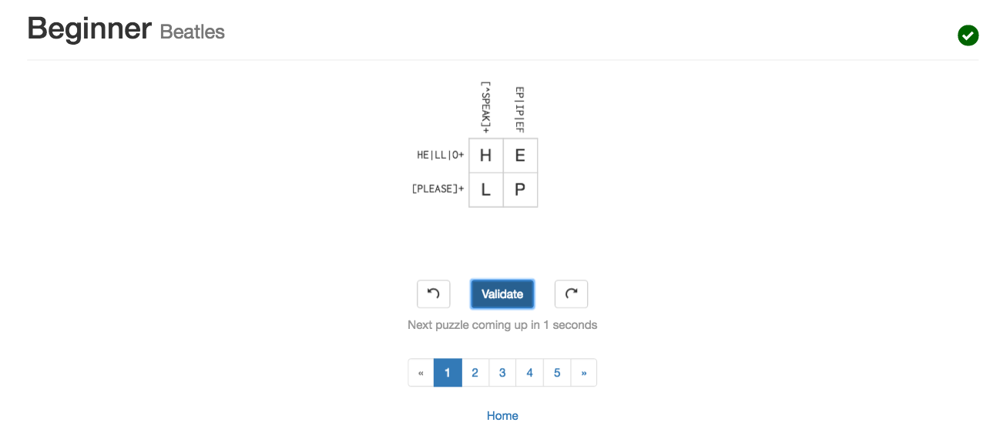
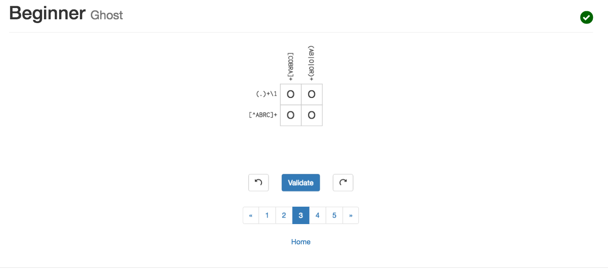
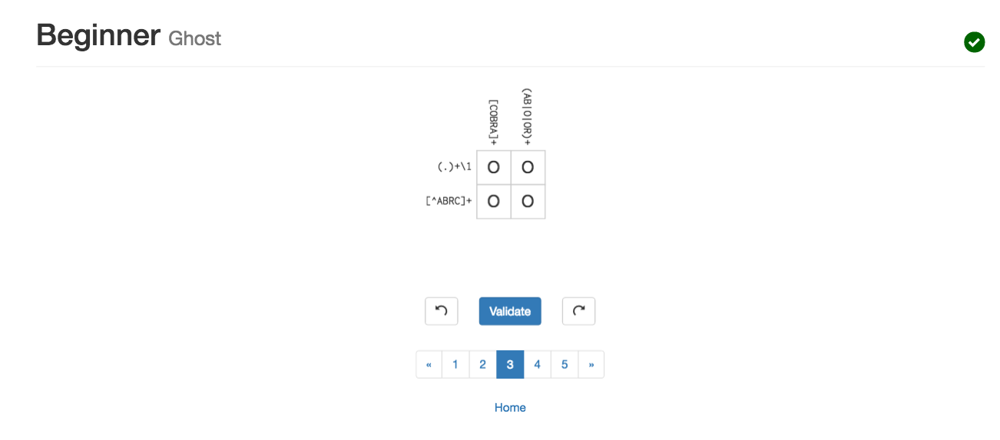
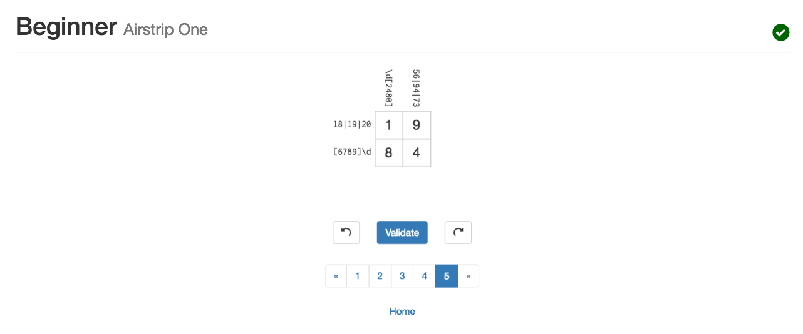

## Part a - github:
    1. I have created and setup a Github account.
    2. I have created a repository for all my lab work.

## Part b - Create a bio page in your repository:
      I have created a bio page and included all the required information in the bio page. 

## Part c - Reading assignments:
1. I have read the 10 criteria of Open Source Definition and I understood why they are important.
2. I have read Eric Raymond's article How To Ask Questions The Smart Way and here are some of my suggestions for How To Answer Questions in a Helpful Way.
    + Read the answer carefully before replying; try to understand what the problem is and make your answer short, concise, and straightforward.
    + Avoid digression from the immediate topic. 
    + Provide examples for your solutions if possible. 
    + Cite any sources you use to answer the questions. 
    + Assume the questioner has little knowledge on the subject.
   
3. I have read chapter 3 of Free Culture and here is some of the lessons I have learned from reading this chapter:
Creating and improving a technology may benefit a community in many different ways. However, this technology could be misused by some people. The abuse of the technology may result in lawsuits against the creator of this technology. While the creator of this technology may not be directly responsible for the the abuse of his technology, in the of judicial system, he may be held responsible. Even though the technologist has not promoted the abuse of the technology he he has created or encouraged it in any way, he may still lose the case for many different reasons. Therefore, it is important for the creator of the technology to monitor how his technology might be used and discourage/prevent users from doing illegal activities. The creator of the technology could possibly win the lawsuits pressed against him, but winning the lawsuits may cost him more money than settling the case with the other party. Therefore, making end-users to accept a software license agreement to indicate how the technology might be used could reduce liability risk.
     

## Part d - Linux:
  1. I have installed Ubuntu on my machine and got familiar with the directory structure.
  2. I have practiced using some of the command in Linux such as ls, cd, mkdir, and chmod.
  3. I have practiced with the grep and egrep commands.
  4. I have installed tree and got the directory structure. Find screen shots below.

## Part e - Regex:
1. I have done all problems on regexone.com. Please find screen shots below.

2. I have done 4 problems on beginner level on regexcrossword. Please find screen shots below. 

## Part f - Play with Blocky:
#####Photo of Blocky - Shortest Path 

#####Photo of Blocky - First Attempt

## Part g - Reflection (Start thinking/finding a problem/project that interests you):
There few projects/problems that I'd like to work on in the near future, but perhaps the most interesting one to me right now is mouse-less browsing. As an Emacs user, I use my keyboard to accomplish most of my daily tasks and Emacs allows me to  effectively browse the web without the need of using my mouse/trackpad. However, when I need to get some information from the internet, I have to leave my keyboard and start using my mouse which makes me less productive. So I started to look for different methods for mouse-less browsing. I am still experimenting with different tools and I have not been able the find the a tool that meets my needs perfectly. So I started thinking about making a Chrome/Firefox extension to effectively browse the web using just the keyboard. I am still reading more about the problem to find out the necessary tools I need to provide an Emacs like web browsing experience.