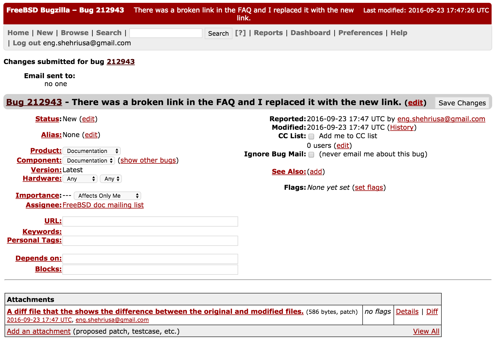

There was a broken link in the FAQ and I replaced it with the new link.

Why it is important to maintain good documentation?

To ensure that developers have the information necessary to be able to contribute to the project and end-users can learn how to use the software properly.

What you have learned from this lab?
Basically, I learned that there are different ways to contribute to open source projects. I was under the impression that open source projects is all about code. It turns out that documentation is an important part of any open source project and developers are not only encouraged to contribute to the project with code but they also can help with the documentation, too. 

https://bugs.freebsd.org/bugzilla/show_bug.cgi?id=212943

