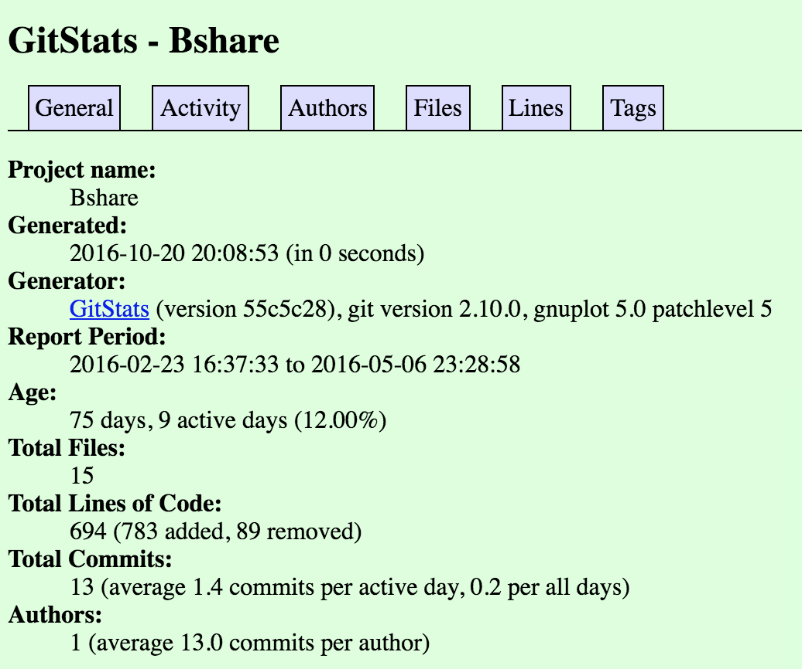

- Project Name: Bshare
- Repo: https://github.com/CMine/Bshare.git
- The number of contributors: 1
- Number of lines of code: 98697 (617)
- The first commit: Initial commit by CMine committed on Feb 23
- The latest commit: Function Update & Organization by CMine committed on May 6.
- The current branches: 1 (master)

#Gitstats#

