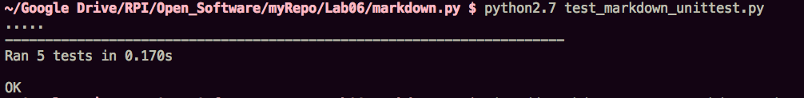

## Part1

- Project Name: Bshare
- Repo: https://github.com/CMine/Bshare.git
- The number of contributors: 1
- Number of lines of code: 98697 (617)
- The first commit: Initial commit by CMine committed on Feb 23
- The latest commit: Function Update & Organization by CMine committed on May 6.
- The current branches: 1 (master)
- Leader: CMine

Evolution of Bshare (Gource Visualization): https://www.youtube.com/watch?v=b4BiKecEluU&feature=youtu.be

<<<<<<< HEAD
## Part1
=======

## Part2 

markdown.py:https://github.com/Alsheh/open_source_course/blob/master/Lab06/markdownf.py 
test_markdown_unittest.py: https://github.com/Alsheh/open_source_course/blob/master/Lab06/test.py
>>>>>>> 2b7a4dc514d9f912e6d4d9a9b24cb052b7cd4fa9
